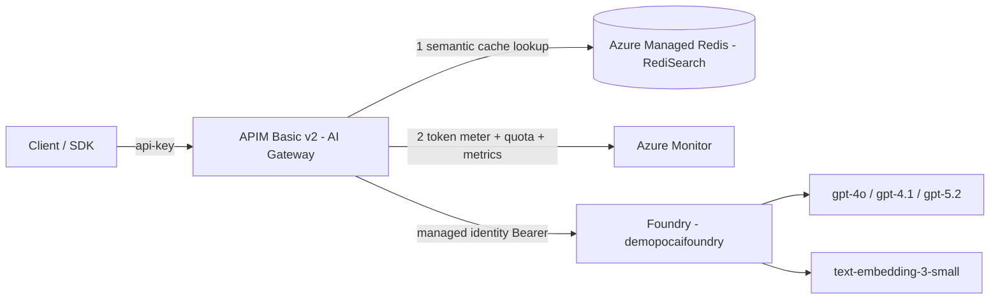

# Foundry AI Gateway (Azure API Management)

Deploys **Azure API Management (Basic v2)** as an **AI Gateway** in front of your
existing Microsoft Foundry resource (`demopocaifoundry`), so you can demonstrate
enterprise AI governance:

| Capability | How it's shown | Policy |
|-----------|----------------|--------|
| **Semantic caching** | A reworded but equivalent prompt is served from cache (much lower latency, no backend call). 60-80% cost savings on repeated queries. | `azure-openai-semantic-cache-lookup` / `-store` |
| **Tokenization / metering** | Every response carries `x-tokens-consumed` and `x-tokens-remaining` (per-minute budget) headers, so token usage is visible per request. | `azure-openai-token-limit` |
| **Hard token quota** | Once the cumulative token quota is spent the gateway returns `403 Forbidden` (deterministic; resets hourly). | `azure-openai-token-limit` (`token-quota`) |
| **Token metrics** | Prompt/completion/total tokens emitted to Azure Monitor under namespace `ai-gateway`. | `azure-openai-emit-token-metric` |
| **Managed-identity backend auth** | The gateway calls Foundry with its own Entra ID identity (no keys stored). | `authentication-managed-identity` |

> This is the standalone-APIM approach, which is required for semantic caching and
> token metrics. The Foundry portal **Manage > AI Gateway** flow auto-creates a
> Basic v2 APIM too, but only covers per-project token limits/quotas — not semantic
> caching. See the [Foundry AI Gateway docs](https://learn.microsoft.com/azure/foundry/configuration/enable-ai-api-management-gateway-portal).

## Architecture



## What gets deployed (all into `demoaifoundry`)

- **API Management** `apim-aigw-*` — Basic v2, system-assigned identity
- **Azure Managed Redis** `amr-aigw-*` — `Balanced_B0`, RediSearch module (vector store for the semantic cache)
- **Log Analytics** `law-aigw-*` — receives gateway request logs (`GatewayLogs`) and LLM logs (`GatewayLlmLogs`)
- **Role assignment** — APIM identity granted **Cognitive Services User** on `demopocaifoundry`
- **APIM API** — Azure OpenAI data-plane API, `openai` path, with the governance policy
- **APIM product + subscription** — provides the demo `api-key`

Nothing on the Foundry resource is modified except one RBAC role assignment.

## Deploy

```powershell
cd ai-gateway
./deploy.ps1
```

Provisioning APIM Basic v2 + Azure Managed Redis takes **~20-40 minutes**. On
completion, connection details are written to `ai-gateway/.env` (git-ignored).

Override defaults if needed:

```powershell
./deploy.ps1 -TokensPerMinute 1000 -EmbeddingsDeployment text-embedding-3-small
```

## Run the demo

```powershell
python test/demo.py
```

You'll see:
1. A cache **miss** (full latency) then a **hit** on the identical and reworded prompts (low latency), and a **miss** on an unrelated prompt.
2. A sequence of calls whose `consumed` / `tpm_remaining` / `quota_remaining` headers count down, ending in a hard **403** once the token quota is spent.

The demo sends a fresh `x-cache-bucket` per run, so the semantic cache and the token
quota are isolated per run and the demo is fully repeatable.

Then open **APIM > Monitoring > Metrics**, namespace `ai-gateway`, to see
`Total Tokens` / `Prompt Tokens` / `Completion Tokens`.

## Tuning

- **More cache hits:** raise `score-threshold` toward `0.2` (already the default). It is a **distance** (0.0-1.0): *lower = stricter*, and values above `0.2` risk false matches. Tune in [policies/ai-gateway-policy.xml](policies/ai-gateway-policy.xml) or via `./deploy.ps1 -ScoreThreshold 0.15`.
- **Trigger the 403 sooner:** lower `token-quota` in [policies/ai-gateway-policy.xml](policies/ai-gateway-policy.xml) and redeploy.
- **Enforcement note:** on Basic v2 the *per-minute* `tokens-per-minute` limit uses a continuously-refilling token bucket, so it meters reliably but only throttles (`429`) under sustained/concurrent load. The `token-quota` cap is a hard cumulative limit and returns `403` deterministically — that's what the demo uses.
- **Semantic caching does not apply to streaming** (`"stream": true`) responses.

## Observability

Two signals flow to Azure Monitor:

- **Metrics** (immediate): platform `Requests` metric and custom token metrics under
  namespace `ai-gateway` — see **APIM > Monitoring > Metrics**.
- **Logs** (a few minutes' ingestion delay): `GatewayLogs` and `GatewayLlmLogs` are sent
  to the `law-aigw-*` Log Analytics workspace as resource-specific tables. Query them in
  **APIM > Monitoring > Logs**:

```kusto
ApiManagementGatewayLogs
| where TimeGenerated > ago(1h)
| project TimeGenerated, OperationName, ResponseCode, BackendResponseCode, TotalTime
| order by TimeGenerated desc
```

```kusto
// LLM-specific request logs (model, token counts)
ApiManagementGatewayLlmLog
| where TimeGenerated > ago(1h)
| order by TimeGenerated desc
```

## Cost

Basic v2 APIM (~$0.07/hr) + Azure Managed Redis `Balanced_B0` are billed while
running. Delete when finished:

```powershell
az apim delete -n <apim-name> -g demoaifoundry --yes
az redisenterprise delete -n <redis-name> -g demoaifoundry --yes
```
